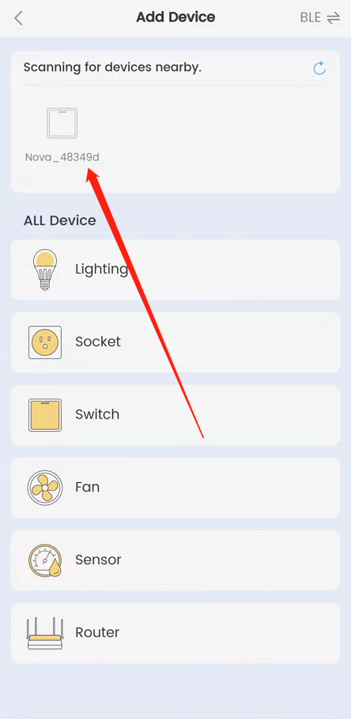
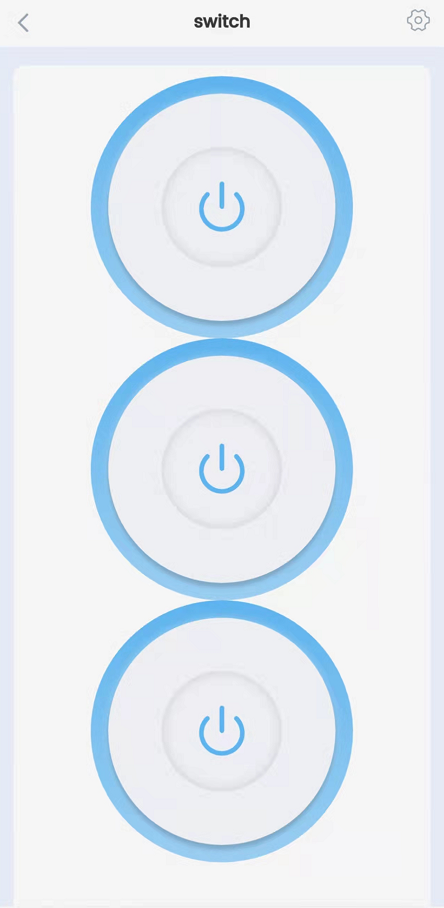

- [English Version](./APP_User_Guide_EN.md)
## NovaHome 使用步骤

1. 下载 NovaHome APP

   - [安卓版](https://play.google.com/store/apps/details?id=com.espressif.novahome)
   - [iOS 版](https://apps.apple.com/cn/app/nova-home/id1563728960?ign-mpt=uo%2525252525253D4)

2. 打开 NovaHome APP ，点击右上角的加号 “+” 即可开始扫描附近的设备
   

   

3. 点击扫到的设备，输入 Wi-Fi 账号和密码进行配网
   

     

4. 配网完成后返回主界面，点击 “switch” 后进入控制界面。
   

     

