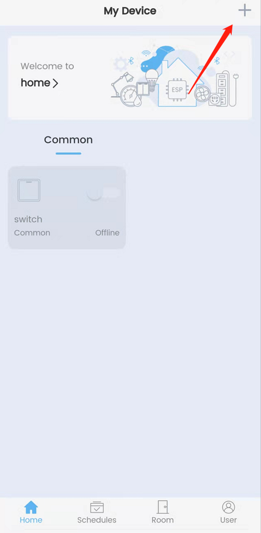
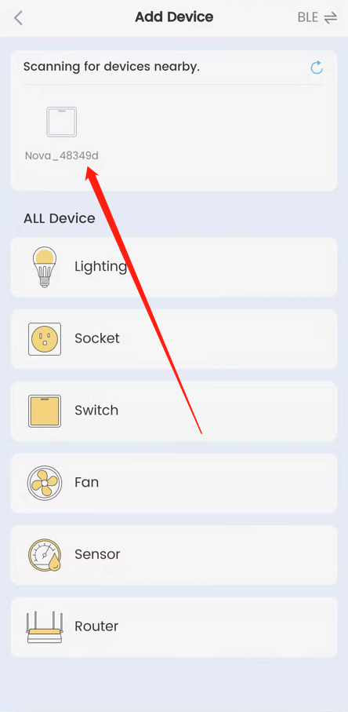
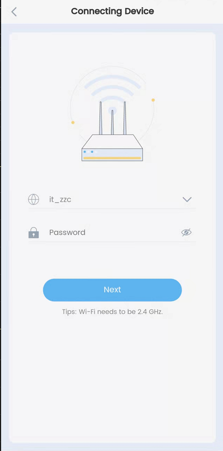
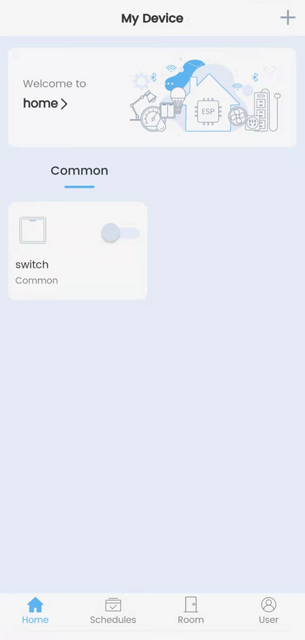
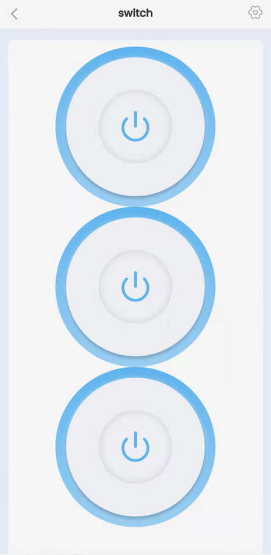

- [中文版本](./APP_User_Guide_CN.md)
## User Guide for NovaHome

1. Download the NoveHome APP

   - [Android] (https://play.google.com/store/apps/details?id=com.espressif.novahome)
   - [iOS] (https://apps.apple.com/cn/app/nova-home/id1563728960?ign-mpt=uo%2525252525253D4)

2. Open the novahome APP after flashing, click the  “+”  on top right to start scanning the device.
   

   

3. When find the device, click it and input the SSID and password.
   

     

4. After connecting to the Internet, return to rhe main interface and click the “switch”  to control.
   

     

